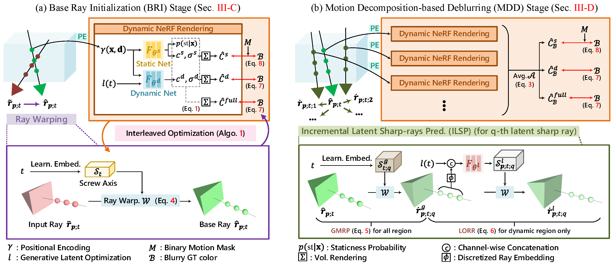

<div><h2>[TPAMI'25] MoBluRF: Motion Deblurring Neural Radiance Fields for Blurry Monocular Video</h2></div>
<br>

**[Minh-Quan Viet Bui](https://quan5609.github.io/)<sup>1\*</sup>, [Jongmin Park](https://sites.google.com/view/jongmin-park)<sup>1\*</sup>, [Jihyong Oh](https://cmlab.cau.ac.kr/)<sup>2†</sup>, [Munchurl Kim](https://www.viclab.kaist.ac.kr/)<sup>1†</sup>** 
<br>
<sup>1</sup>KAIST, South Korea, <sup>2</sup>Chung-Ang University, South Korea
<br>
\*Co-first authors (equal contribution), †Co-corresponding authors
<p align="center">
        <a href="https://kaist-viclab.github.io/moblurf-site/" target='_blank'>
        
        </a>
        <a href="https://ieeexplore.ieee.org/document/11017407" target='_blank'>
        
        </a>
        <a href="https://arxiv.org/abs/2312.13528" target='_blank'>
        
        </a>
        <a href="https://huggingface.co/datasets/ImJongminPark/BlurryIPhone" target="_blank" ></a>
        

</p>

<p align="center">
  
</p>

## 📣 News
### Updates
- **October 24, 2025**: Code released.
- **May 28, 2025**: MoBluRF was published in TPAMI 2025 🎉.
- **December 21, 2023**: Paper uploaded to arXiv. Check out the manuscript [here](https://arxiv.org/abs/2312.13528).
### To-Dos
- Add Stereo Blur dataset configurations.
## ⚙️ Environment Setup
Tested on **Python 3.8, PyTorch 1.13.1, CUDA 11.7, JAX 0.4.1**.

```sh
git clone --recursive https://github.com/KAIST-VICLab/moblurf.git
cd moblurf

# Conda env
conda create -n moblurf python=3.8 -y
conda activate moblurf

# PyTorch (CUDA 11.7)
conda install pytorch==1.13.1 torchvision==0.14.1 torchaudio==0.13.1 pytorch-cuda=11.7 -c pytorch -c nvidia

# JAX (CUDA11)
python -m pip install --upgrade pip
pip install "jax==0.4.1" "jaxlib==0.4.1+cuda11.cudnn82" -f https://storage.googleapis.com/jax-releases/jax_cuda_releases.html

# Project deps (no torch/jax in this file)
pip install -r requirements.txt
```

## 📁 Data Preparations

### Blurry iPhone Dataset

We host the Blurry iPhone Dataset on Dropbox and the [🤗 Huggingface](https://huggingface.co/datasets/ImJongminPark/BlurryIPhone).  
You can download our dataset via command-line below:

```bash
# Create root directory
mkdir -p data

# Download dataset zip from Dropbox
wget "https://www.dropbox.com/scl/fi/cez7kds7yoc6kdcsptrpq/blurry_iphone.zip?rlkey=nhdxuzsyfubqpliodksnue5xf&st=yfz33ums&dl=1" \
    -O data/blurry_iphone.zip

# Unzip
unzip data/blurry_iphone.zip -d data/blurry_iphone

# Or download on Huggingface
git clone https://huggingface.co/datasets/ImJongminPark/BlurryIPhone
```

After extraction, the dataset will follow this structure (example for apple):

```bash
data/blurry_iphone/
  ├── apple/
  │   ├── blurry_rgb/2x/*.png
  │   ├── normal/2x/*.npy
  │   ├── depth/2x/*.npy
  │   ├── camera_interp/*.json
  │   ├── covisible/2x/val/*.png
  │   ├── keypoint/2x/train/*.json
  │   ├── scene.json
  │   ├── dataset.json
  │   ├── metadata.json
  │   ├── extra.json
  │   ├── emf.json
  │   └── splits/
```

## Training

**Order matters.** Train **BRI** first, then start **MDD** initialized from the BRI checkpoint.

### 1) BRI Stage (train first)
```bash
CUDA_VISIBLE_DEVICES=0,1,2,3 python tools/launch.py --gin_configs configs/experiments/blurry_iphone/runs/bri/apple.gin --gin_bindings Config.engine_cls=@Trainer --gin_bindings "SEQUENCE='apple'"
```

### 2) MDD Stage (initialize from the BRI checkpoint)
```bash
CUDA_VISIBLE_DEVICES=0,1,2,3 python tools/launch.py --gin_configs configs/experiments/blurry_iphone/runs/mdd/apple.gin --gin_bindings Config.engine_cls=@Trainer --gin_bindings "SEQUENCE='apple'"
```

## Evaluation

```bash
python tools/launch.py --gin_configs configs/experiments/blurry_iphone/runs/mdd/apple.gin --gin_bindings Config.engine_cls=@Evaluator --gin_bindings "SEQUENCE='apple'"
```

## ⭐ Citing MoBluRF

If you find our repository useful, please consider giving it a star ⭐ and citing our research papers in your work:
```bibtex
@article{bui2025moblurf,
  title={Moblurf: Motion deblurring neural radiance fields for blurry monocular video},
  author={Bui, Minh-Quan Viet and Park, Jongmin and Oh, Jihyong and Kim, Munchurl},
  journal={IEEE Transactions on Pattern Analysis and Machine Intelligence},
  year={2025},
  publisher={IEEE}
}
```

## Acknowledgments
This project is developed with [Dycheck](https://github.com/KAIR-BAIR/dycheck) codebase. We thank the original authors for their excellent work.